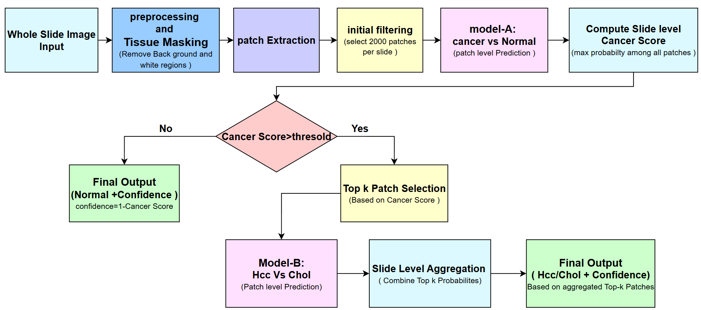
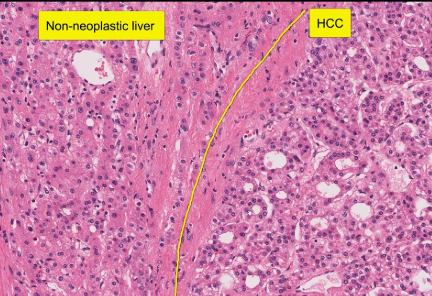
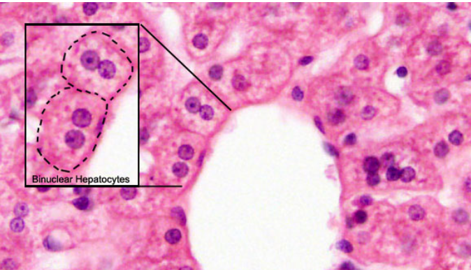
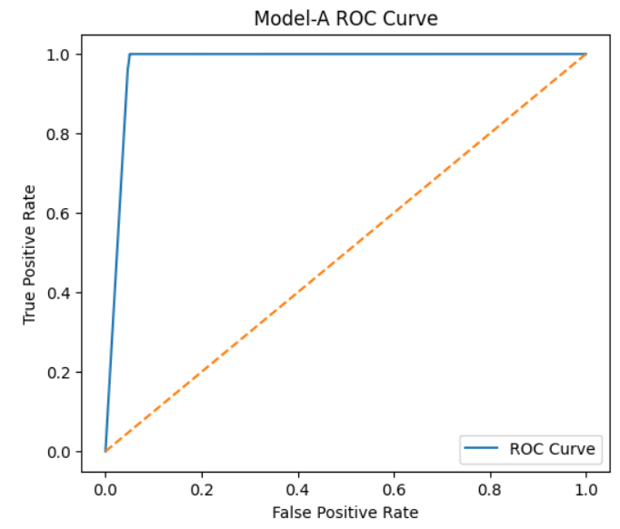
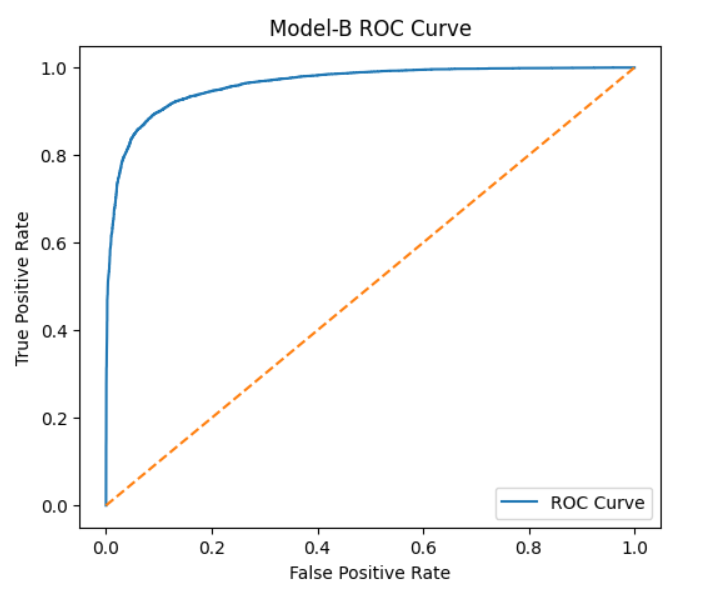
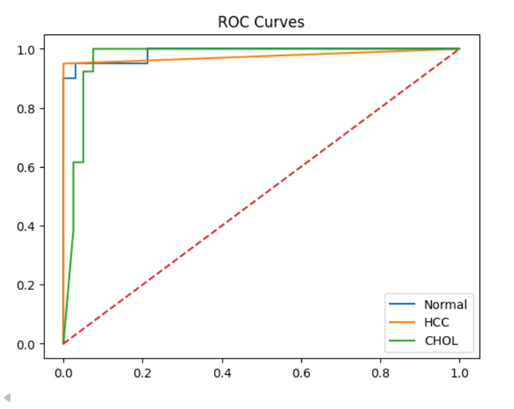
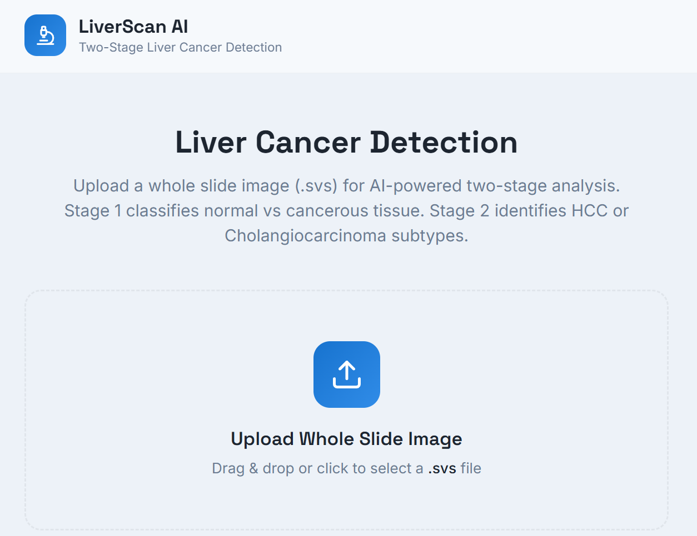
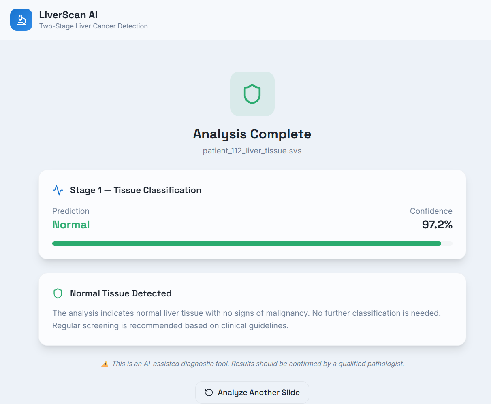
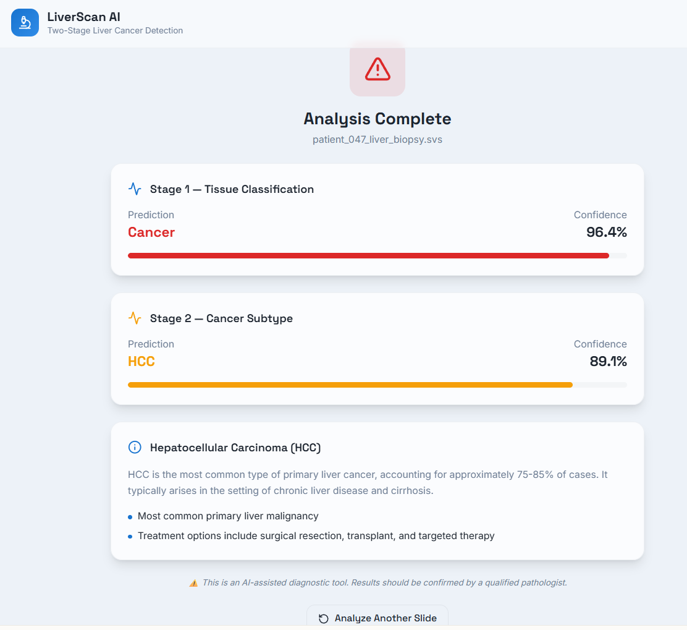

# 🧬 Liver Cancer Detection and Subtype Classification from Histopathology Images

A Two-Stage Transformer Framework for Automated Liver Cancer Detection and Subtype Classification using Histopathological Whole-Slide Images (WSIs).

This project introduces a hierarchical deep learning framework that combines:

- Swin Transformer architecture
- Selective Top-K Patch Aggregation
- Multi-stage classification
- Whole-slide image processing
- Web-based diagnostic interface

The framework performs:

1. **Stage-1:** Normal vs Cancer Detection  
2. **Stage-2:** HCC vs CHOL Subtype Classification

---

# 📌 Research Overview

Histopathological whole-slide images contain massive amounts of redundant and non-informative tissue regions. Traditional exhaustive patch aggregation often introduces noise and reduces diagnostic reliability.

This project proposes:

- Tissue-aware preprocessing
- Confidence-driven Top-K patch selection
- Hierarchical slide-level aggregation
- Transformer-based contextual learning

to improve classification robustness and clinical relevance.

---

# 🧠 Proposed Framework

<p align="center">
  
</p>

---

# 🔬 Histopathology Sample Images

## Hepatocellular Carcinoma (HCC)

<p align="center">
  
</p>

## Cholangiocarcinoma (CHOL)

<p align="center">
  
</p>

---

# ⚙️ System Architecture

## Stage-1: Cancer Detection

- Input WSI
- Patch Extraction
- Swin Transformer Feature Learning
- Binary Classification:
  - Normal
  - Cancer

---

## Stage-2: Subtype Classification

If cancer is detected:

- Top-K informative patches selected
- Subtype prediction performed:
  - HCC
  - CHOL

---

# 🧩 Key Features

✅ Hierarchical Two-Stage Framework  
✅ Swin Transformer Backbone  
✅ Confidence-Based Top-K Patch Selection  
✅ Whole-Slide Image Analysis  
✅ Slide-Level Aggregation  
✅ Statistical Validation  
✅ Web-Based Deployment  
✅ Clinically Aligned Diagnostic Pipeline  

---

# 📊 Experimental Results

| Model | Task | Slide-Level Accuracy |
|------|------|------|
| Model-A | Normal vs Cancer | 94.00% |
| Model-B | HCC vs CHOL | 93.54% |
| Overall Pipeline | Multi-Class Classification | 94.34% |

---

# 📈 ROC Curves

## Model-A ROC Curve

<p align="center">
  
</p>

---

## Model-B ROC Curve

<p align="center">
  
</p>

---

## Overall Multi-Class ROC Curve

<p align="center">
  
</p>

---

# 🖥️ Web-Based Diagnostic Interface

## Upload Interface

<p align="center">
  
</p>

---

## Normal Tissue Prediction

<p align="center">
  
</p>

---

## Cancer Subtype Prediction

<p align="center">
  
</p>

---

# 🛠️ Technologies Used

| Technology | Purpose |
|---|---|
| Python | Core Development |
| PyTorch | Deep Learning |
| Swin Transformer | Feature Extraction |
| OpenSlide | WSI Processing |
| NumPy | Numerical Operations |
| Pandas | Data Handling |
| Scikit-learn | Evaluation Metrics |
| Matplotlib | Visualization |
| Flask | Web Application |
| HTML/CSS/JavaScript | Frontend |

---

# 📂 Project Structure

```bash
Liver-Cancer-Detection/
│
├── assets/
│   ├── methodology.png
│   ├── hcc_sample.png
│   ├── chol_sample.png
│   ├── normal_sample.png
│   ├── roc_model_a.png
│   ├── roc_model_b.png
│   ├── roc_overall.png
│   ├── upload_interface.png
│   ├── normal_prediction.png
│   └── cancer_prediction.png
│
├── dataset/
│
├── models/
│   ├── model_a.pth
│   └── model_b.pth
│
├── static/
├── templates/
├── app.py
├── train_model_a.py
├── train_model_b.py
├── inference.py
├── requirements.txt
└── README.md
```

---

# 🚀 Installation

## Clone Repository

```bash
git clone https://github.com/Renukeshpragada/LIVER_CANCER_DETECTION
```

---

## Navigate into Project

```bash
cd Liver-Cancer-Detection
```

---

## Create Virtual Environment

### Windows

```bash
python -m venv venv
venv\Scripts\activate
```

### Linux / Mac

```bash
python3 -m venv venv
source venv/bin/activate
```

---

## Install Dependencies

```bash
pip install -r requirements.txt
```

---

# ▶️ Run Application

```bash
python app.py
```

---

# 📊 Statistical Validation

| Metric | Model-A | Model-B | Overall |
|---|---|---|---|
| ROC-AUC | 0.9760 | 0.9627 | 0.9770 |
| Cohen’s Kappa | 0.9482 | 0.7859 | 0.9145 |
| Sensitivity | 0.9600 | 0.9868 | 0.9500 |
| Specificity | 0.9200 | 0.8989 | 0.9700 |

---

# 🎯 Research Contributions

- Hierarchical cancer diagnosis framework
- Confidence-based Top-K patch prioritization
- Transformer-based contextual modeling
- Improved slide-level diagnostic reliability
- Efficient suppression of redundant tissue regions

---

# 🔮 Future Work

- Multi-center dataset validation
- Explainable AI integration
- Adaptive patch selection
- Real-time WSI streaming
- Clinical deployment optimization

---

# 📚 Research Paper

**Title:**  
*A Two-Stage Transformer Framework for Liver Cancer Detection and Subtype Classification from Histopathology Images*

---

# 👨‍💻 Authors

- Pragada Renukesh Durgaprasad
- Dr. K. Praveen Kumar
- Simma Sasi Kiran

---

# 📜 License

This project is intended for research and academic purposes.

---

# ⭐ If you found this project useful

Please consider starring the repository.